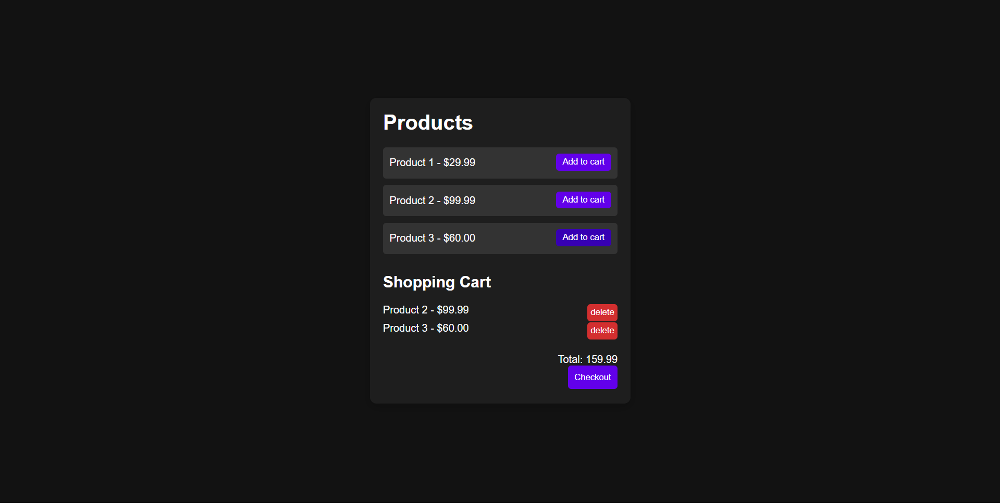

# 🛒 Shopping Cart using Vanilla JavaScript

A simple shopping cart app built using HTML, CSS, and JavaScript that lets users add, remove, and checkout products — with cart data stored in the browser's localStorage.

---

## Features

- Add products to cart dynamically  
- Remove items from the cart  
- View total price of all cart items  
- Cart contents are saved using `localStorage`  
- Simulated checkout clears the cart and shows a success message  
- Responsive and easy-to-use interface  
- **Products are hardcoded in JavaScript** (no backend or database)

---

## How It Works

- The app displays a list of products defined inside the JavaScript file.
- Clicking **"Add to cart"** stores the selected product in the cart array.
- The cart is displayed with:
  - Product name  
  - Price  
  - A delete button for each item
- The total price updates automatically.
- The **Checkout** button clears the cart and shows an alert.
- Cart data is stored and retrieved using `localStorage` so it persists even after refresh.

---

## Technologies Used

- ✅ HTML  
- ✅ CSS  
- ✅ JavaScript (ES6)  
- ✅ localStorage for persistence

---

## Getting Started

1. Clone or download this repository.
2. Open `index.html` in your browser.
3. Start adding items to the cart, deleting them, or checking out.

No build tools or installations required.

---

## Preview

  
*Example preview of the shopping cart in action.*

> *(Replace `preview.png` with your actual screenshot file.)*
